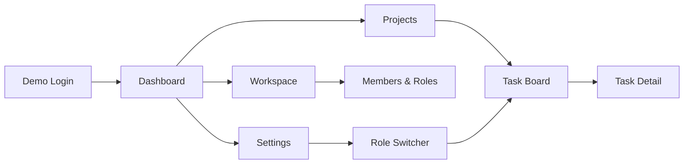
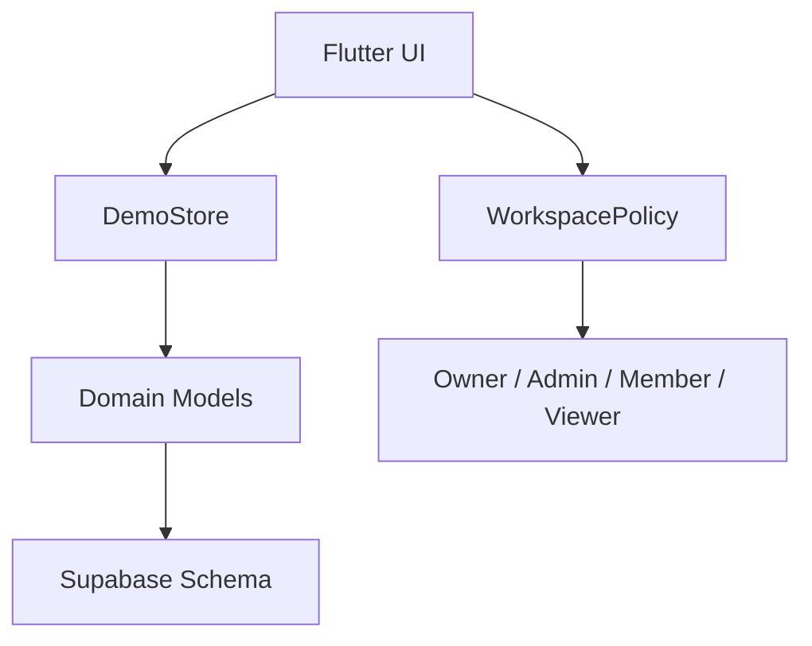

# TaskFlow

TaskFlow is a polished Flutter portfolio project that demonstrates a collaborative project and task management app for small teams.

The project is built to show practical Junior Flutter Developer skills: adaptive UI, clean feature structure, demo authentication, role-aware behavior, task workflows, tests, CI, and honest documentation.

It is not a copied tutorial app and not a default Flutter counter demo. TaskFlow is designed as a recruiter-friendly product demo that can be cloned, run, reviewed, and extended.

---

## Quick Preview

TaskFlow runs immediately in demo mode. No Supabase account, API keys, backend setup, or paid services are required.

```bash
flutter pub get
flutter run
```

Then choose **Continue in demo mode**.

What you can review in the first few minutes:

* Dashboard with realistic team/project metrics.
* Projects with progress, status, and direct task-board navigation.
* Task workspace with list view, Kanban-style columns, search, filters, sorting, status updates, and task detail panel.
* Workspace members with role badges.
* Settings screen with role switching between Owner, Admin, Member, and Viewer.
* Adaptive layouts for mobile, tablet, desktop, and web.

---

## Product Walkthrough



Recommended demo path:

1. Launch the app.
2. Continue in demo mode.
3. Review the dashboard metrics and recent activity.
4. Open **Projects** and select a project.
5. Use **Open task board** to inspect related tasks.
6. Try search, status filter, priority filter, and sorting.
7. Open a task detail panel and review labels, assignee, comments, and activity.
8. Go to **Settings** and switch the demo role to Viewer.
9. Return to tasks/projects and confirm that restricted actions are hidden or disabled.

---

## Features

### Authentication And Demo Session

* Login screen.
* Demo login mode.
* Seeded demo users.
* Friendly validation.
* Logout flow.
* No backend required for local review.

### Dashboard

* Active project metrics.
* Due soon and overdue task indicators.
* Completed work summary.
* Recent activity feed.
* Responsive card layout.

### Projects

* Project list with status and progress.
* Task completion summary.
* Project-to-task-board navigation.
* Responsive project cards.
* Mobile overflow-safe layout.

### Tasks

* Task list and Kanban-style workflow.
* Search.
* Status filtering.
* Priority filtering.
* Sorting.
* Status updates.
* Task detail panel/sheet.
* Labels, assignee, comments, and activity timeline.

### Workspace And Roles

* Workspace members.
* Role badges.
* Demo invite/settings feedback.
* Role-aware UI behavior.
* Owner, Admin, Member, and Viewer permissions.

### UI And Responsiveness

* Material 3 based interface.
* Dark, light, and system theme modes.
* Mobile bottom navigation.
* Tablet navigation rail.
* Desktop side navigation.
* Adaptive spacing and layout behavior.
* Recruiter-friendly product feel.

---

## Demo Users

Any password with six or more characters works for seeded demo emails.

| Role   | Email                  |
| ------ | ---------------------- |
| Owner  | `olivia@taskflow.demo` |
| Admin  | `alex@taskflow.demo`   |
| Member | `mia@taskflow.demo`    |
| Viewer | `victor@taskflow.demo` |

The Settings screen includes a role switcher, so reviewers can quickly inspect how the UI changes for different permission levels.

---

## Roles And Permissions

| Capability                    | Owner | Admin | Member | Viewer |
| ----------------------------- | ----- | ----- | ------ | ------ |
| View workspace                | Yes   | Yes   | Yes    | Yes    |
| Manage workspace settings     | Yes   | No    | No     | No     |
| Manage members                | Yes   | Yes   | No     | No     |
| Create projects               | Yes   | Yes   | No     | No     |
| Edit projects                 | Yes   | Yes   | No     | No     |
| Delete projects               | Yes   | No    | No     | No     |
| Create tasks                  | Yes   | Yes   | Yes    | No     |
| Edit any task                 | Yes   | Yes   | No     | No     |
| Edit assigned/unassigned task | Yes   | Yes   | Yes    | No     |
| Comment                       | Yes   | Yes   | Yes    | No     |

Role behavior is handled in Flutter through `WorkspacePolicy`.

In a production backend, these rules should also be enforced with database-level security, such as Supabase Row Level Security policies.

---

## Architecture

TaskFlow uses a feature-first structure with a lightweight demo data layer.

```text
lib/
  app/
    shell, theme, navigation, app composition

  core/
    permissions, responsive helpers, reusable widgets

  data/
    demo data store and seeded demo workspace

  features/
    auth/
    dashboard/
    projects/
    tasks/
    workspaces/
    settings/

  models/
    domain models and enums

supabase/
  migrations/
    PostgreSQL schema and RLS intent

test/
  unit and widget tests

docs/
  release checklist
```

The goal is to keep the project understandable for a Junior Flutter Developer portfolio while still demonstrating clean boundaries, reusable components, and realistic product thinking.

---

## State And Data Flow



Current implementation:

* Demo data is stored in memory.
* UI reads and updates state through a central demo store.
* Permission checks are separated into a dedicated policy layer.
* Supabase schema exists as the planned production persistence foundation.

---

## Tech Stack

* Flutter
* Dart
* Material 3
* Dart null safety
* ChangeNotifier / InheritedNotifier for lightweight demo state
* Flutter test
* GitHub Actions
* Supabase/PostgreSQL schema foundation

The dependency set is intentionally lean so the project remains easy to run, review, and maintain.

---

## Supabase Foundation

Runtime Supabase integration is not wired yet. The repository includes a database schema foundation for future production work.

Included migration:

```text
supabase/migrations/0001_initial_schema.sql
```

The schema covers:

* profiles
* workspaces
* workspace members
* projects
* tasks
* labels
* task labels
* task comments
* activity events
* timestamps
* enums
* RLS intent

Environment example:

```text
SUPABASE_URL=
SUPABASE_ANON_KEY=
TASKFLOW_FORCE_DEMO=true
```

This keeps the repository honest: TaskFlow is demo-ready now, and Supabase-ready at the schema level.

---

## Quality

Run the standard quality checks:

```bash
dart format .
flutter analyze
flutter test
flutter build web
flutter build apk --debug
```

The project includes tests for:

* permission behavior
* demo login flow
* seeded demo data
* task filters and sorting
* project-to-task navigation
* role-aware UI behavior
* smoke coverage for core screens

Manual QA steps are documented in:

```text
docs/release-checklist.md
```

---

## Repository Highlights

This project demonstrates:

* Building a complete Flutter app from an empty starter project.
* Creating an adaptive UI across mobile, tablet, desktop, and web.
* Designing reusable product-style components.
* Implementing role-aware UI behavior.
* Writing realistic demo data for portfolio review.
* Keeping backend scope honest while preparing a Supabase schema.
* Adding tests and CI instead of relying only on manual checks.
* Maintaining a clean commit history with feature-focused commits.

---

## Known Limitations

TaskFlow is intentionally scoped as a portfolio demo, not a production SaaS.

Current limitations:

* Demo data is stored in memory and resets after restart.
* Theme and selected demo role are not persisted yet.
* Runtime Supabase auth and CRUD repositories are not implemented.
* Kanban uses selectable cards and status controls instead of drag-and-drop.
* Comments are displayed as seeded demo content; full comment creation is roadmap work.

These limitations are documented deliberately to avoid overclaiming unfinished functionality.

---

## Roadmap

Planned improvements:

* Add Supabase runtime repositories for auth and CRUD.
* Add concrete production Row Level Security policies.
* Persist theme, selected role, and selected workspace locally.
* Add drag-and-drop Kanban interactions.
* Add comment creation and richer task editing.
* Add profile editing.
* Add workspace invitation flow.
* Add end-to-end tests for the main demo path.

---

## Recruiter Notes

TaskFlow is built to demonstrate more than basic Flutter syntax.

It shows:

* product thinking
* responsive UI composition
* clean project organization
* role and permission modeling
* practical testing habits
* realistic documentation
* awareness of production backend requirements

The app can be reviewed immediately in demo mode, while the codebase leaves a clear path for future backend integration.